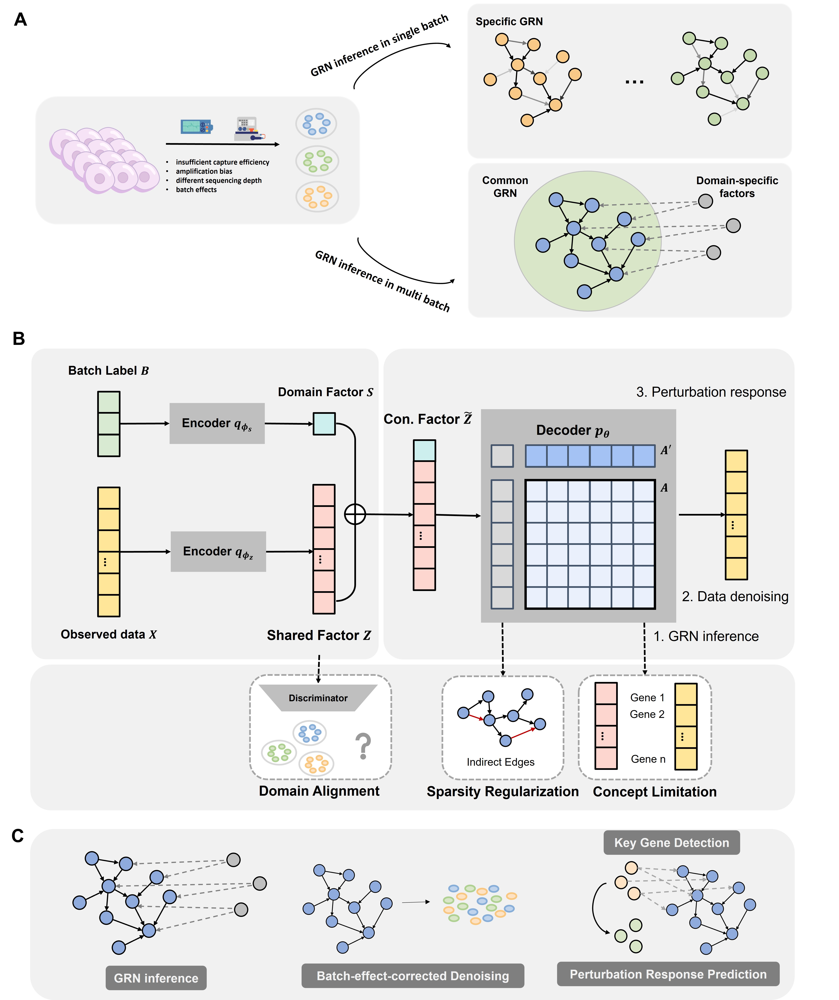

# ComGRN: multi-domain single-cell sequencing data integration analysis guided by Common Gene Regulatory Network
[](https://opensource.org/licenses/MIT)

This repository contains code, data, tables and plots to support data analyses and reproduce results from the paper ComGRN: multi-domain single-cell data analysis guided by Common Gene Regulatory Network.
- [Abstract](#abstract)
- [Overview](#overview)
- [Installation Guide](#installation-guide)
- [Usage](#Usage)
- [Data Availability](#data-availability)
- [License](#license)

# Abstract
Single-cell sequencing technologies have transformed biological research by providing detailed insights into cellular functions and phenotypes. However, analyzing single-cell data is challenging due to mixed variability from biological differences and technical noise, including random noise (sparsity or estimation errors) and non-random noise (batch effects). We propose using gene regulatory networks (GRNs) as invariants across batches to guide data integration and expression recovery. Traditional GRN inference methods often overlook batch effects, focusing on single-batch data. Our framework, ComGRN, constructs GRNs from multi-batch datasets and integrates these datasets based on the constructed GRNs. ComGRN integrates a variational auto-encoder with a structural equation model to separate batch-specific noise from true biological signals, enhancing the accuracy of gene regulatory relationships. This approach effectively mitigates batch effects and seamlessly integrates multi-batch datasets. Experiments show ComGRN's superior performance in preserving biological information and gene regulatory relationships, excelling in data denoising, data integration, marker gene identification, and perturbation response prediction. ComGRN provides a powerful tool for single-cell RNA sequencing data analysis, offering researchers more reliable and insightful results.

# Overview


# Dependencies
List the libraries and tools required to run the project:
```
numpy
scipy
PyTorch
scikit-learn
pandas
scanpy
anndata
igraph
umap
tqdm
omegaconf
```
For specific setting, please see <a href="https://github.com/fdu-wangfeilab/ComGRN/blob/main/environment.yml">requirement</a>.

# Installation Guide
```
$ git clone https://github.com/fdu-wangfeilab/ComGRN.git
$ conda create -n ComGRN_env python=3.8
$ conda activate ComGRN_env
$ conda env create -f environment.yml
```

# Detailed tutorials with example datasets
The example can be seen in the <a href="https://github.com/fdu-wangfeilab/ComGRN/blob/main/main.py">main.py</a>.

# Data Availability
The data that support the findings of this study are openly available in *****.

# License
This project is covered under the **MIT License**.
